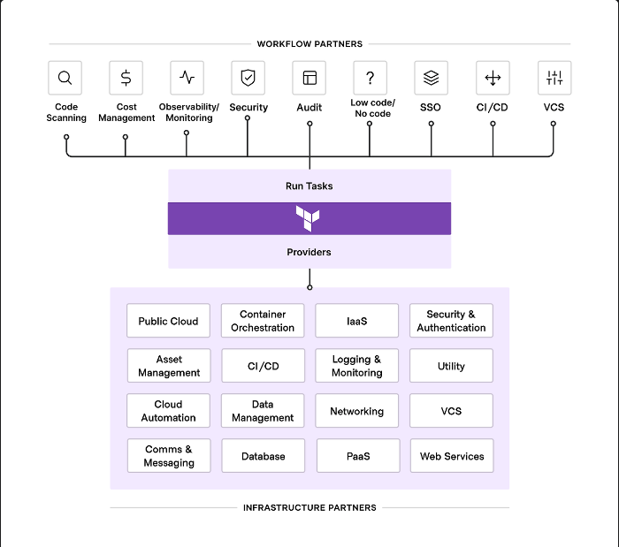

## 4장. 프로바이더

개요
- 테라폼은 로컬환경이나 배포 서버와 같은 원격 환겨에 원하는 대상을 호출하는 방식으로 실행됨
- 원하는 대상을 호출할 때 프로바이더가 제공하는 API를 호출해 상호작용함
- 상호작용 할 수 있도록 하는 것이 프로바이더


구성
- 유지보수 및 권한에 따라 Tier 정보가 존재
- official - partner - community - archived
- aws 는 official


프로바이더 지정
```tf
terraform {
    required_providers {
        architect-http = {
            source = "architect-team/http"
            version = "~> 3.0"
        }
        aws-http = {
            source = "terraform-aws-module/http"
        }
    }
}

data "http" "example" {
    provider = aws-http
    ...
}
```
- `<로컬이름> = {}` 형식
- 로컬이름은 유니크 해야 함
- 로컬이름과 리소스 접두사(위 예에서는 http)는 독립적 선언
- 만약 동일한 접두사를 선언하는 프로바이더가 선언되면, provider 인수를 명시하여, 특정 프로바이더를 선택할 수 있음
- 동일한 source 에 대해 다수의 정의는 불가능


단일 프로바이더 다중 정의
```tf
provider "aws" {
    region = "us-west-1"
}

provider "aws" {
    alias = "seoul"
    region = "ap-northeast-2"
}

resource "aws_instance" "app_server" {
    provider = aws.seoul
}

```
- 동일한 프로바이더를 사용하지만 다른 조건을 가지는 경우, alias를 명시하여 지정 가능


프로바이더 요구 사항 정의
- source: 프로바이더 다운로드 경로
- version: 버전 제약 / 생략시 init 시점 최신 버전


프로바이더 설치
- required_providers 에 지정된 프로바이더가 있는 경우, 사용여부에 상관없이 프로바이더 다운로드
- 지정하지 않더라도, 코드상에서 사용된 프로바이더는 테라폼이 추론해 최신 버전의 프로바이더 다운로드

프로바이더 간의 전환
- 불가능
- 서로 다른 API

프로바이더 에코 시스템


- 사용자가 사용하는 방식과 구조에 따란 모든 곳에 테라폼을 적용할 수 있도록 설계 됨
- 워크플로 파트너와 인프라 파트너로 나뉨
- 프로바이더의 경우 인프라 파트너에 해당
- 깃허브의 사용자, 팀, 저장소, 브랜치 등도 프로비저닝 가능

aws 프로바이더 경험해보기
```tf
terraform {
    required_providers {
        aws = {
            source = "hashicorp/aws"
            version = "~>4.0"
        }
    }

    required_version = ">= 1.0"
}

provider "aws" {
    region = "ap-northeast-2"
}

data "aws_ami" "amzn2" {
    most_recent = true
    owners = ["amazon"]
}

resource "aws_instance" "app_server" {
    ami = data.aws_ami.amzn2.id
    instance_type = "t3.micro"

    tags = {
        Name = "ExampleAppServerInstance"
    }
}

```